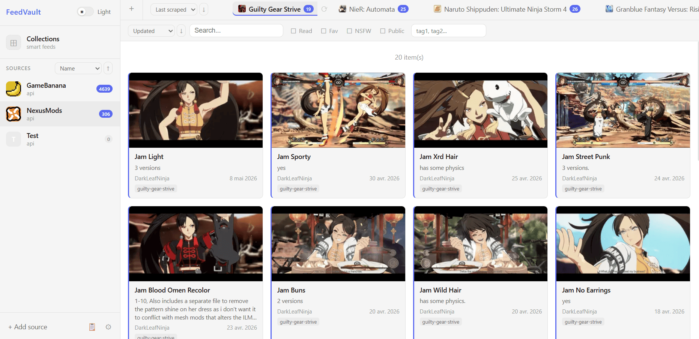
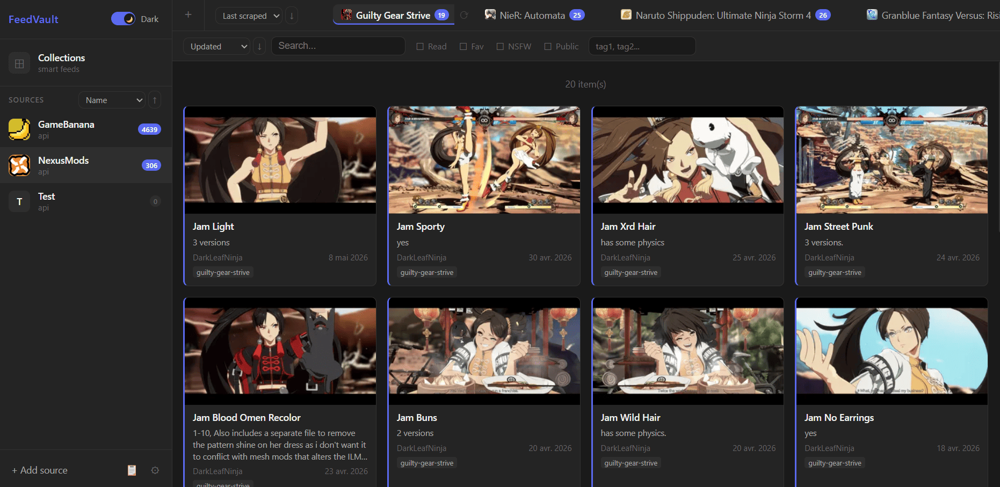

# FeedVault

A self-hosted universal feed aggregator aiming to support RSS feeds, REST APIs, and HTML scraping. Data is normalized into a common format, stored locally in SQLite, and browsable through a Svelte web interface.



Dark Mode is supported:



---

## Features

- **Multiple source types** — RSS, REST API, and custom scrapers
- **Normalized data model** — items from any source share a same common structure
- **Collections** — cross-source virtual feeds built from filters (by source, feed, tags, or any combination)
- **Incremental, full & range scraping** — configurable per feed, with job history and detailed logs
- **Media management** — thumbnails downloaded and compressed locally to WebP
- **Import / Export** — full JSON backup and restore, with hierarchical selection
- **Credential management** — per-source API keys stored encrypted (with Fernet)

---

## Stack

| Layer           | Technology                             |
| --------------- | -------------------------------------- |
| Backend         | Python 3.11+, FastAPI                  |
| ORM / DB        | SQLModel + SQLite (Alembic migrations) |
| Scraping        | `httpx`, `feedparser`, `BeautifulSoup` |
| Images          | `Pillow` (WebP, 300×400px max)         |
| Frontend        | Svelte 5 + Vite                        |
| Package manager | `uv` (backend), `npm` (frontend)       |

---

## Project Structure

```
feedvault/
├── backend/
│   ├── app/
│   │   ├── api/             # FastAPI routers
│   │   ├── core/            # Scraping abstractions, crypto, image utils
│   │   │   └── sources/     # BaseSource, APISource, scraper registry (public)
│   │   ├── models/          # SQLModel table + Pydantic models
│   │   ├── sources/         # Concrete scraper implementations (private submodule)
│   │   └── main.py
│   ├── alembic/             # DB migrations
│   └── media/               # Downloaded thumbnails (gitignored)
└── frontend/
    └── src/
        ├── lib/
        │   ├── api/         # API client wrappers
        │   ├── components/  # Svelte components
        │   ├── stores/      # Svelte stores (navigation, filters, sorting, theme)
        │   └── utils/       # Helpers (formatting, context menu, grid state)
        └── App.svelte
```

---

## Getting Started

### Prerequisites

- Python 3.11+
- [`uv`](https://github.com/astral-sh/uv)
- Node.js 18+

### 1. Clone the repository

```bash
git clone https://github.com/relhamdi/feedvault.git
cd feedvault
```

FeedVault works by using a separate, private repository containing actual source scrapers. You can add your own by modifying the URL in the `.gitmodules` file to point to your repository.
Sources must be linked to the `backend/app/sources/` folder.

Then, just initialize it:

```bash
git submodule update --init --recursive
```

> Note: When creating your sources, don't forget to use the `@register_scraper` decorator to be able to bootstrap it later (see [Writing a scraper](#writing-a-scraper)).

### 2. Configure the backend

```bash
cd backend
cp .env.example .env
```

Generate a Fernet encryption key for credentials storage and paste it into `.env`:

```bash
python -c "from cryptography.fernet import Fernet; print(Fernet.generate_key().decode())"
```

Edit `.env` and fill in the required values (see [Configuration](#configuration)).

### 3. Install and start the backend

```bash
cd backend

# Install dependencies
uv sync

# Run database migrations
uv run alembic upgrade head

# Start the API server
uv run uvicorn app.main:app --reload
```

The API will be available at [http://localhost:8000](http://localhost:8000).
Interactive docs: [http://localhost:8000/docs](http://localhost:8000/docs).

### 4. Install and start the frontend

```bash
cd frontend

# Install dependencies
npm install

# Start the interface
npm run dev
```

The interface will be available at [http://localhost:5173](http://localhost:5173).

### 5. First use

Once both servers are running:

1. Open [http://localhost:5173](http://localhost:5173)
2. Go to **Settings → Sources** and click **Bootstrap all** to register available sources
3. Click **+ Add source** in the sidebar or use **bootstrap sources** in the settings
4. Select a source and add a feed to it
5. Click the scrape button (⟳) on the feed tab to run your first scrape
6. Items will appear in the grid after the fetch

---

## Configuration

All backend configuration is done via environment variables in `backend/.env`:

| Variable       | Description                                                             | Default                    |
| -------------- | ----------------------------------------------------------------------- | -------------------------- |
| `FERNET_KEY`   | Encryption key for stored credentials — **generate once, never change** | **required**               |
| `MEDIA_DIR`    | Path to store downloaded thumbnails                                     | `./media`                  |
| `DATABASE_URL` | SQLite database path                                                    | `sqlite:///./feedvault.db` |

> ⚠️ Changing `FERNET_KEY` after sources with credentials have been saved will make those credentials unreadable.

**For the frontend:** if you run the backend on a different port or host, update `API_BASE_URL` in `frontend/src/lib/config.js`.

---

## Scraper Submodule

Concrete source implementations live in `backend/app/sources/`, which is intended to be a **private Git submodule** containing your own scrapers.

This public repo only ships the base classes and registry in `backend/app/core/sources/`.

### Using your own scrapers repository

Create a private repo with your scrapers, then attach it as a submodule:

```bash
git submodule add https://github.com/your-username/feedvault-sources backend/app/sources
git submodule update --init
```

### Writing a scraper

A scraper is a Python class registered via a decorator:

```python
from app.core.sources.base import BaseSource
from app.core.sources.api import APISource
from app.core.sources.registry import register_scraper
from app.core.sources.models import RawItem, NormalizedItem, ScrapeJob
from app.models.source import SourceType

@register_scraper(
    "mysource",
    default_source={
        "name": "My Source",
        "source_type": SourceType.API,
        "base_url": "https://api.example.com/v1",
        "color": "#3B82F6",
    },
    credentials_schema={"api_key": "Your API key"},
    params_schema={        
        "feed_target": ParamField(
            description="Game ID",
        ),
        "external_ids": ParamField(
            description="Optional list of mod IDs",
            type=ParamType.TEXTAREA,
        ),
    },
)
class MySource(APISource):
    @staticmethod
    def parse_feed_url(url: str) -> dict:
        """Extract feed params from a URL pasted by the user."""
        return {"feed_target": url.rstrip("/").split("/")[-1]}

    def fetch(self, job: ScrapeJob) -> list[RawItem]:
        """Fetch raw items from the source."""
        data, _ = self.get(f"/items", params={"target": self.params["feed_target"]})
        return [RawItem(external_id=str(item["id"]), data=item) for item in data]

    def map(self, raw: RawItem) -> NormalizedItem:
        """Map a raw item to the normalized format."""
        d = raw.data
        return NormalizedItem(
            external_id=raw.external_id,
            title=d["title"],
            url=d["url"],
            source_published_at=self._ts_to_dt(d["created_at"]),
            source_updated_at=self._ts_to_dt(d["updated_at"]),
        )
```

> Note: This is the bare minimum to register a scraper. More info is available in `backend\app\core\sources\base.py`

Once your scraper file is in `backend/app/sources/`, import it in `backend/app/sources/__init__.py`:

```python
from app.sources.mysource import MySource  # noqa: F401
```

Then bootstrap it from the UI: **Settings → Sources → Bootstrap all**.

### Param field types

The `params_schema` dict accepts `ParamField` instances that control how the frontend renders each input:

| Type             | Rendered as                              | Extra fields                             |
| ---------------- | ---------------------------------------- | ---------------------------------------- |
| `text` (default) | Single-line text input                   | —                                        |
| `textarea`       | Multi-line input, comma-separated values | —                                        |
| `number`         | Number input                             | `min`, `max`, `default`                  |
| `select`         | Dropdown                                 | `options: list[SelectOption]`, `default` |

`default` values are injected into `feed.params` at feed creation time and used to pre-fill the form.

---

## Scraping Modes

| Mode            | Description                                                                |
| --------------- | -------------------------------------------------------------------------- |
| **Incremental** | Fetches items updated since the last scrape — fast, low API usage          |
| **Full**        | Fetches all available items — marks items no longer returned as non-public |
| **Range**       | Fetches items updated between two dates                                    |

The default mode is configurable in **Settings → Scraping**. Individual feeds can be scraped in any mode from the feed tab context menu.

> Note: Even in INCREMENTAL mode, every first scrape acts like a FULL scraping.

You can also specify specific IDs of pages to scrap in the feed parameters. You'll have to support the `fetch_by_ids` method, and add an `external_ids` field in the `feed.params` section.

> Note: The RANGE mode is experimental and heavily depends on the source.


---

## Data Model

Items from all sources share a normalized structure:

```
Source → Feed → Item
                 ├── Author
                 ├── Categories[]
                 └── Media[]        (images, files, links, code)
```

Collections are saved filter combinations (by source, feed, and/or tags) resolved at query time — they are virtual views, not materialized copies.

---

## Import / Export

FeedVault can export the full database or a selection to a portable JSON file.

- Sources, feeds, and items are identified by stable string keys (slug, URL, external ID)
- Credentials are excluded by default — exporting them in plain text requires explicit opt-in
- Media files are **not** included in the export — back up the `media/` folder separately alongside your database
- Collections are resolved to string references and imported last, after all sources and feeds exist

```
Settings → Export data → select sources/feeds → configure options → download
Settings → Import → select file → choose conflict strategy (upsert / skip)
```

There is two conflict strategies for the import, either `upsert` to add an item or update it if found in the database, or `skip` to add an item, or skip it if found in the database.

---

## Database Migrations

After modifying a SQLModel model, generate and apply a migration:

```bash
cd backend

# Generate migration
uv run alembic revision --autogenerate -m "describe your change"

# Review the generated file in alembic/versions/, then apply
uv run alembic upgrade head
```

Migrations use `render_as_batch=True` for SQLite compatibility (required for column alterations).

---

## API

The REST API is self-documented via Swagger UI at [http://localhost:8000/docs](http://localhost:8000/docs).

Key endpoints:

| Method                  | Path                               | Description                      |
| ----------------------- | ---------------------------------- | -------------------------------- |
| `GET`                   | `/health`                          | Health check                     |
| `GET`                   | `/stats`                           | Global DB stats                  |
| `GET/POST/PATCH/DELETE` | `/api/v1/sources/`                 | Source CRUD                      |
| `POST`                  | `/api/v1/sources/bootstrap/{slug}` | Bootstrap a source from registry |
| `GET/POST/PATCH/DELETE` | `/api/v1/feeds/`                   | Feed CRUD                        |
| `GET/POST/PATCH/DELETE` | `/api/v1/items/`                   | Item CRUD with filters           |
| `GET/POST/PATCH/DELETE` | `/api/v1/collections/`             | Collection CRUD                  |
| `GET`                   | `/api/v1/collections/{id}/items`   | Resolve collection items         |
| `POST`                  | `/api/v1/scrape/`                  | Start a scrape job               |
| `GET/DELETE`            | `/api/v1/scrape/jobs`              | Job history                      |
| `POST`                  | `/api/v1/data/export`              | Export data (JSON download)      |
| `POST`                  | `/api/v1/data/import`              | Import data (JSON upload)        |
| `DELETE`                | `/api/v1/data/reset`               | Clear all data                   |

---

## Frontend

### Key stores

| Store           | Description                                                         |
| --------------- | ------------------------------------------------------------------- |
| `navigation.js` | Selected source, feed, collection                                   |
| `filters.js`    | Item filters (read, favorite, NSFW, search, tags) — session only    |
| `sorting.js`    | Sort field and order per entity — persisted in localStorage         |
| `ui.js`         | Grid size, active context menu ID — persisted in localStorage       |
| `stats.js`      | Cached stats per feed/source/collection — refreshed after mutations |
| `scraping.js`   | Job polling, default scrape mode                                    |
| `theme.js`      | Light/dark theme — persisted in localStorage                        |

### Shared utilities

- `utils/itemGridState.js` — shared logic for item grids (toggle read/favorite, refresh, context menu builder)
- `utils/modal.js` — backdrop handlers (click outside, Escape key)
- `utils/format.js` — date formatting, BBCode parser, job status helpers


---

## Roadmap

- RSS source + MAnual scraping support
- Scrape job cancellation + queue
- Retry scraping with exponential backoff on API errors
- Card size presets (S / M / L)
- Per-source Pydantic validation models
- Mobile responsive layout
